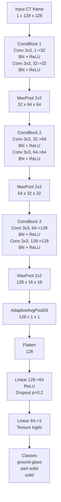
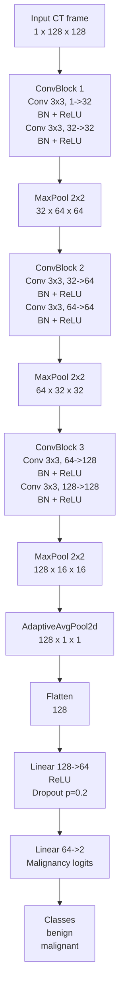
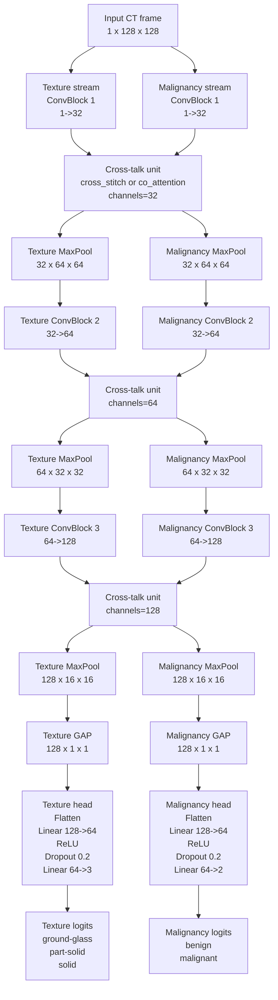

# TextureOnlyNet Sketch

Source:
- [train_texture_only.py](/c:/Users/mraic/OneDrive/Desktop/Scoala/Master/Sem2/IM/code/projects-team7/code/src/training/train_texture_only.py:322)

This sketch reflects the convolutional model defined in `TextureOnlyNet` and `ConvBlock`.

## Model Flow



## Compact Shape Trace

```text
Input                         :  1 x 128 x 128
ConvBlock(1 -> 32)           : 32 x 128 x 128
MaxPool2d(2, 2)              : 32 x  64 x  64
ConvBlock(32 -> 64)          : 64 x  64 x  64
MaxPool2d(2, 2)              : 64 x  32 x  32
ConvBlock(64 -> 128)         : 128 x 32 x  32
MaxPool2d(2, 2)              : 128 x 16 x  16
AdaptiveAvgPool2d(1, 1)      : 128 x  1 x   1
Flatten                      : 128
Linear(128 -> 64) + ReLU     : 64
Dropout(0.2)                 : 64
Linear(64 -> 3)              : 3 logits
```

## Notes

- Each `ConvBlock` contains two `3x3` convolutions with `padding=1`, each followed by batch normalization and ReLU.
- Pooling happens after every block.
- The head predicts only texture, with `3` output classes.
- The default input size is `128x128`, taken from `--image-size 128`.

---

# MalignancyOnlyNet Sketch

Source:
- [train_malignancy_only.py](/c:/Users/mraic/OneDrive/Desktop/Scoala/Master/Sem2/IM/code/projects-team7/code/src/training/train_malignancy_only.py:313)

This sketch reflects the convolutional model defined in `MalignancyOnlyNet` and `ConvBlock`.

## Model Flow



## Compact Shape Trace

```text
Input                         :  1 x 128 x 128
ConvBlock(1 -> 32)           : 32 x 128 x 128
MaxPool2d(2, 2)              : 32 x  64 x  64
ConvBlock(32 -> 64)          : 64 x  64 x  64
MaxPool2d(2, 2)              : 64 x  32 x  32
ConvBlock(64 -> 128)         : 128 x 32 x  32
MaxPool2d(2, 2)              : 128 x 16 x  16
AdaptiveAvgPool2d(1, 1)      : 128 x  1 x   1
Flatten                      : 128
Linear(128 -> 64) + ReLU     : 64
Dropout(0.2)                 : 64
Linear(64 -> 2)              : 2 logits
```

## Notes

- The convolutional backbone is identical to `TextureOnlyNet`.
- The only architectural difference is the final classifier: `Linear(64 -> 2)` for malignancy prediction.
- The output classes are `benign` and `malignant`.
- The default input size is `128x128`, taken from `--image-size 128`.

---

# MultiTaskCrossTalkNet Sketch

Source:
- [train_multitask_texture_malignancy.py](/c:/Users/mraic/OneDrive/Desktop/Scoala/Master/Sem2/IM/code/projects-team7/code/src/training/train_multitask_texture_malignancy.py:389)

This sketch reflects the multitask model defined in `MultiTaskCrossTalkNet`, with two parallel CNN streams and a cross-talk unit after each block.

## Model Flow



## Compact Shape Trace

```text
Input                              :   1 x 128 x 128

Texture stream:
ConvBlock(1 -> 32)                :  32 x 128 x 128
Cross-talk unit                   :  32 x 128 x 128
MaxPool2d(2, 2)                   :  32 x  64 x  64
ConvBlock(32 -> 64)               :  64 x  64 x  64
Cross-talk unit                   :  64 x  64 x  64
MaxPool2d(2, 2)                   :  64 x  32 x  32
ConvBlock(64 -> 128)              : 128 x  32 x  32
Cross-talk unit                   : 128 x  32 x  32
MaxPool2d(2, 2)                   : 128 x  16 x  16
AdaptiveAvgPool2d(1, 1)           : 128 x   1 x   1
Flatten                           : 128
Linear(128 -> 64) + ReLU          : 64
Dropout(0.2)                      : 64
Linear(64 -> 3)                   : 3 logits

Malignancy stream:
ConvBlock(1 -> 32)                :  32 x 128 x 128
Cross-talk unit                   :  32 x 128 x 128
MaxPool2d(2, 2)                   :  32 x  64 x  64
ConvBlock(32 -> 64)               :  64 x  64 x  64
Cross-talk unit                   :  64 x  64 x  64
MaxPool2d(2, 2)                   :  64 x  32 x  32
ConvBlock(64 -> 128)              : 128 x  32 x  32
Cross-talk unit                   : 128 x  32 x  32
MaxPool2d(2, 2)                   : 128 x  16 x  16
AdaptiveAvgPool2d(1, 1)           : 128 x   1 x   1
Flatten                           : 128
Linear(128 -> 64) + ReLU          : 64
Dropout(0.2)                      : 64
Linear(64 -> 2)                   : 2 logits
```

## Cross-Talk Units

### `cross_stitch`

```text
[tex features] ----\
                    >  learnable 2x2 mixing  -> [new tex features]
[mal features] ----/

[tex features] ----\
                    >  learnable 2x2 mixing  -> [new mal features]
[mal features] ----/
```

- Uses a learned `2x2` matrix shared across all spatial locations.
- Default initialization is close to identity with small cross-task mixing:
  `[[0.9, 0.1], [0.1, 0.9]]`.

### `co_attention`

```text
mal stream -- global mean over H,W -- MLP -- sigmoid gate --\
                                                             +--> tex + gate * mal

tex stream -- global mean over H,W -- MLP -- sigmoid gate --\
                                                             +--> mal + gate * tex
```

- Builds a channel-wise gate from the other task stream.
- Injects cross-task information as a gated residual.

## Notes

- There are two separate convolutional branches: one for texture, one for malignancy.
- Each branch uses the same block widths: `1 -> 32 -> 64 -> 128`.
- Cross-talk happens after each pair of same-depth blocks and before pooling.
- The texture head outputs `3` logits; the malignancy head outputs `2` logits.
- The default input size is `128x128`, taken from `--image-size 128`.
